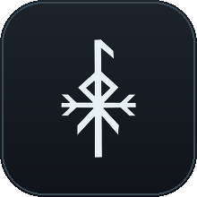
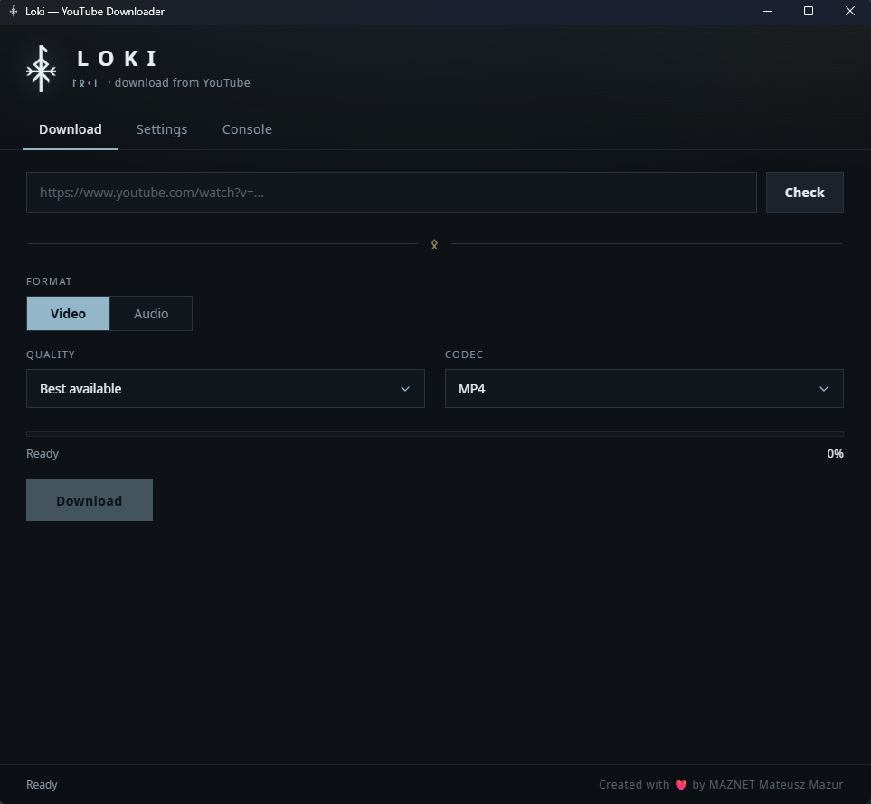

<a name="top"></a>
<div align="center">

<p align="center">
  
</p>

<h1 align="center">Loki — YouTube Downloader</h1>

**Lekka aplikacja desktopowa do pobierania wideo i audio z YouTube**<br />
**A clean, lightweight desktop app for downloading video and audio from YouTube**




### [🇵🇱 Polski](#polski) · [🇬🇧 English](#english)

</div>

---

## Polski

Natywne okno napędzane przez [pywebview](https://pywebview.flowrl.com/), silnik pobierania oparty na
[yt-dlp](https://github.com/yt-dlp/yt-dlp), całość ubrana w subtelny interfejs inspirowany nordycką mitologią.

### Opis

Wklej adres filmu z YouTube, a Loki pobierze jego metadane — tytuł, kanał, długość i miniaturę.
Następnie wybierasz, czy chcesz **wideo** (MP4 / MKV) w dowolnej dostępnej rozdzielczości, czy samo
**audio** (MP3 / WAV) w wybranej jakości. Pobieranie możesz w każdej chwili wstrzymać, wznowić albo
anulować, a wbudowana konsola pokazuje na bieżąco, co robi silnik.

Bez Qt i bez dołączanego Chromium: interfejs to zwykły HTML/CSS/JS renderowany przez systemowe
środowisko uruchomieniowe **Edge WebView2**. FFmpeg nie jest ręczną zależnością — aplikacja pobiera go
automatycznie do katalogu `bin/`, gdy okaże się potrzebny.

### Funkcje

- **Wideo** (MP4 / MKV) w dowolnej dostępnej rozdzielczości — łącznie z wariantami **60 FPS** (np. `1080p60`, `720p60`)
- **Audio** (MP3 / WAV) z wybieranym bitrate'em (128–320 kbps)
- **Pauza / wznowienie / anulowanie** w trakcie pobierania
- **Automatyczna konfiguracja FFmpega** — jeśli go brakuje, aplikacja proponuje pobranie przy pierwszym uruchomieniu
- **Treści z ograniczeniem wiekowym** obsługiwane przez ciasteczka, z **szyfrowanym** magazynem (Windows DPAPI) — konfigurujesz raz, bez ciągłego eksportowania na nowo
- **Dwujęzyczność** — polski / angielski, przełączane na żywo w ustawieniach
- **Podgląd filmu** (tytuł, kanał, długość, miniatura) oraz wbudowana konsola dziennika
- **Motyw nordycki** — chłodna, ostra kolorystyka i autorska ikona oparta na wiązanej runie Lokiego

### Wymagania

| Zależność | Wersja    |
|-----------|-----------|
| Windows   | 10 / 11   |
| Python    | 3.11+     |
| pywebview | 5.0+      |
| yt-dlp    | najnowszy |

> Python jest potrzebny wyłącznie do uruchomienia ze źródeł — spakowany plik `.exe` go nie wymaga.
> W systemie Windows pywebview korzysta ze środowiska [Edge WebView2](https://developer.microsoft.com/microsoft-edge/webview2/),
> preinstalowanego w Windows 11.

### Szybki start

```bash
git clone https://github.com/MowMiMazur/Loki-YouTube-Downloader.git
cd Loki-YouTube-Downloader
python -m venv .venv && .venv\Scripts\activate     # Windows
pip install -r requirements.txt
python main.py
```

1. Przy pierwszym uruchomieniu, jeśli brakuje FFmpega, Loki zapyta o jego pobranie — zaakceptuj i gotowe.
2. Wklej adres filmu i poczekaj na podgląd.
3. Wybierz **wideo** albo **audio**, format i jakość.
4. Kliknij **Pobierz** — postęp śledzisz na pasku i w konsoli.

### Filmy z ograniczeniem wiekowym (ciasteczka)

Część filmów (18+, tylko dla członków kanału, wymagające zalogowania) potrzebuje Twojej sesji YouTube.
Loki obsługuje dwa sposoby:

1. **Plik cookies.txt (zalecane).** Wyeksportuj ciasteczka rozszerzeniem *„Get cookies.txt LOCALLY”*,
   a następnie wybierz **Ustawienia → Cookies → Wczytaj plik…**. Plik jest **szyfrowany za pomocą
   Windows DPAPI** (powiązany z Twoim kontem Windows) i przechowywany lokalnie — oryginał możesz
   usunąć. Konfigurujesz raz i nie musisz później zamykać przeglądarki.
2. **Ciasteczka z przeglądarki.** Wskaż przeglądarkę w ustawieniach. Pamiętaj, że przeglądarki oparte
   na Chromium blokują swoją bazę ciasteczek w trakcie działania, więc przed każdym pobieraniem
   przeglądarka musi być **zamknięta**.

### Rozwiązywanie problemów

- **Dziwne lub brakujące opcje jakości** → Twój `yt-dlp` jest najprawdopodobniej nieaktualny (YouTube
  często się zmienia). Otwórz **Ustawienia → Silnik pobierania** i kliknij **Aktualizuj**, a potem
  uruchom aplikację ponownie.
- **„Nie znaleziono FFmpega”** → pozwól okienku startowemu go pobrać albo umieść `ffmpeg.exe` w `bin/`.
- **Błędy ciasteczek** → upewnij się, że wybrana przeglądarka jest całkowicie zamknięta, albo skorzystaj
  z opisanej wyżej metody z szyfrowanym plikiem cookies.txt.

### Struktura projektu

```
Loki-YouTube-Downloader/
├── main.py               # Punkt wejścia
├── requirements.txt
├── Loki.spec             # Konfiguracja PyInstallera
├── build.ps1             # Skrypt budowania dla Windows (jedna komenda)
├── assets/               # Logo i ikony
├── fonts/                # Noto Sans
├── loki/                 # Backend (logika)
│   ├── app.py            # Okno webview
│   ├── api.py            # Most JS <-> Python (pywebview.api)
│   ├── info.py           # Pobieranie metadanych
│   ├── downloader.py     # Pobieranie mediów (wątki, pauza / anulowanie)
│   ├── ffmpeg.py         # Wykrywanie i pobieranie FFmpega
│   ├── cookies.py        # Szyfrowany magazyn ciasteczek (DPAPI)
│   ├── settings.py       # Trwałe ustawienia
│   ├── logger.py         # Logger yt-dlp
│   └── paths.py          # Ścieżki (źródła / PyInstaller)
├── web/                  # Cały interfejs użytkownika
│   ├── index.html        # Powłoka aplikacji (jedna strona)
│   ├── styles.css        # Style
│   ├── app.js            # Logika interfejsu
│   ├── dropdown.js       # Własne listy rozwijane (zamiast natywnych <select>)
│   └── i18n.js           # Wspólny słownik PL/EN
├── bin/                  # ffmpeg.exe / ffprobe.exe (pobierane automatycznie)
└── config/               # settings.json (konfiguracja użytkownika)
```

### Budowanie pliku wykonywalnego

```powershell
.\build.ps1
```

Skrypt pyta o numer wersji, stempluje ją w projekcie, doinstalowuje brakujące zależności i PyInstallera,
buduje jednoplikowy program dla Windows (dołączając katalogi `web/`, `assets/` i `fonts/`), po czym
zapisuje wynik do `exec/Loki-v{wersja}.exe` i sprząta po sobie. Katalogi `bin/` (FFmpeg) oraz `config/`
(ustawienia) tworzone są obok pliku `.exe` przy pierwszym uruchomieniu.

> Jeśli PowerShell blokuje uruchamianie skryptów, wykonaj jednorazowo:
> `Set-ExecutionPolicy -Scope CurrentUser RemoteSigned`

### Zastrzeżenie

Loki jest wyłącznie nakładką na `yt-dlp`. Pobieraj tylko te treści, do których masz prawo, i przestrzegaj
Warunków korzystania z serwisu YouTube oraz obowiązującego prawa autorskiego.

### Podziękowania

- [yt-dlp](https://github.com/yt-dlp/yt-dlp) — silnik pobierania
- [pywebview](https://pywebview.flowrl.com/) — natywne okno webview
- [FFmpeg](https://ffmpeg.org/) — scalanie i konwersja
- Czcionki: [Noto Sans](https://fonts.google.com/noto/specimen/Noto+Sans)

### Licencja

Projekt udostępniany na **Licencji Apache 2.0** — możesz go swobodnie używać, modyfikować
i rozpowszechniać, również w projektach komercyjnych. W zamian musisz **zachować informację
o autorstwie**: pozostawić noty o prawach autorskich i autorstwie, dołączyć plik [NOTICE](NOTICE)
(wskazujący Mateusza Mazura / MAZNET jako autora) do każdej kopii lub pracy pochodnej oraz oznaczyć
wprowadzone przez siebie zmiany. Szczegóły w pliku [LICENSE](LICENSE).

### Autor

**Mateusz Mazur** (MAZNET) · [maznet.pl](https://maznet.pl) · logo oparte na wiązanej runie Lokiego

<div align="right"><a href="#top">↑ do góry</a></div>

---

## English

A native window powered by [pywebview](https://pywebview.flowrl.com/), a download engine built on
[yt-dlp](https://github.com/yt-dlp/yt-dlp), wrapped in a subtle Norse-inspired UI.

### Overview

Paste a YouTube link and Loki pulls its metadata — title, channel, length and thumbnail. Then you pick
whether you want **video** (MP4 / MKV) in any available resolution, or **audio** only (MP3 / WAV) at the
quality you choose. Downloads can be paused, resumed or cancelled at any point, and a built-in console
shows exactly what the engine is doing.

No Qt, no bundled Chromium: the UI is plain HTML/CSS/JS rendered through the OS **Edge WebView2**
runtime. FFmpeg is not a manual dependency — the app downloads it automatically into `bin/` when needed.

### Features

- **Video** (MP4 / MKV) in any available resolution — including **60 FPS** variants (e.g. `1080p60`, `720p60`)
- **Audio** (MP3 / WAV) at a selectable bitrate (128–320 kbps)
- **Pause / resume / cancel** while downloading
- **Automatic FFmpeg setup** — if it's missing, the app offers to download it on first run
- **Age-restricted / sign-in content** via cookies, with an **encrypted** cookie store (Windows DPAPI) — set up once, no need to keep re-exporting
- **Bilingual** — Polish / English, switchable live from Settings
- **Video preview** (title, channel, length, thumbnail) and a built-in log console
- **Norse theme** — a sharp, cold palette and a custom Loki bind-rune icon

### Requirements

| Dependency | Version  |
|------------|----------|
| Windows    | 10 / 11  |
| Python     | 3.11+    |
| pywebview  | 5.0+     |
| yt-dlp     | latest   |

> Python is only needed to run from source — the packaged `.exe` does not require it.
> On Windows, pywebview uses the [Edge WebView2](https://developer.microsoft.com/microsoft-edge/webview2/)
> runtime, preinstalled on Windows 11.

### Getting started

```bash
git clone https://github.com/MowMiMazur/Loki-YouTube-Downloader.git
cd Loki-YouTube-Downloader
python -m venv .venv && .venv\Scripts\activate     # Windows
pip install -r requirements.txt
python main.py
```

1. On first launch, if FFmpeg is missing, Loki will ask to download it — accept and you're ready to go.
2. Paste a video URL and wait for the preview.
3. Choose **video** or **audio**, the format and the quality.
4. Click **Download** — track progress on the bar and in the console.

### Age-restricted videos (cookies)

Some videos (18+, members-only, sign-in-gated) require your YouTube session. Loki supports two ways:

1. **cookies.txt file (recommended).** Export cookies with the *"Get cookies.txt LOCALLY"* browser
   extension, then go to **Settings → Cookies → Load file…**. The file is **encrypted with Windows
   DPAPI** (tied to your Windows account) and stored locally — you can delete the original. Set it up
   once, and you don't have to close your browser afterwards.
2. **Cookies from a browser.** Pick your browser in Settings. Note that Chromium-based browsers lock
   their cookie database while running, so the browser must be **closed** before each download.

### Troubleshooting

- **Weird / missing quality options** → your `yt-dlp` is likely outdated (YouTube changes often).
  Open **Settings → Download engine** and click **Update**, then restart the app.
- **"FFmpeg not found"** → let the startup dialog download it, or place `ffmpeg.exe` in `bin/`.
- **Cookie errors** → make sure the selected browser is fully closed, or use the encrypted
  cookies.txt method above.

### Project structure

```
Loki-YouTube-Downloader/
├── main.py               # Entry point
├── requirements.txt
├── Loki.spec             # PyInstaller configuration
├── build.ps1             # One-command Windows build script
├── assets/               # Logo & icons
├── fonts/                # Noto Sans
├── loki/                 # Backend (logic)
│   ├── app.py            # Webview window
│   ├── api.py            # JS <-> Python bridge (pywebview.api)
│   ├── info.py           # Metadata extraction
│   ├── downloader.py     # Media download (threaded, pause / cancel)
│   ├── ffmpeg.py         # FFmpeg detection / download
│   ├── cookies.py        # Encrypted cookie store (DPAPI)
│   ├── settings.py       # Persistent settings
│   ├── logger.py         # yt-dlp logger
│   └── paths.py          # Paths (source / PyInstaller)
├── web/                  # The entire user interface
│   ├── index.html        # App shell (single page)
│   ├── styles.css        # Styles
│   ├── app.js            # UI logic
│   ├── dropdown.js       # Custom dropdowns (replacing native <select>)
│   └── i18n.js           # Shared PL/EN dictionary
├── bin/                  # ffmpeg.exe / ffprobe.exe (auto-downloaded)
└── config/               # settings.json (user config)
```

### Building an executable

```powershell
.\build.ps1
```

Asks for a version, stamps it across the project, installs missing dependencies + PyInstaller, compiles
a single-file Windows executable (bundling `web/`, `assets/` and `fonts/`), writes it to
`exec/Loki-v{version}.exe` and cleans up after itself. The `bin/` (FFmpeg) and `config/` (settings)
folders are created next to the `.exe` on first run.

> If PowerShell blocks script execution, run once:
> `Set-ExecutionPolicy -Scope CurrentUser RemoteSigned`

### Disclaimer

Loki is a front-end for `yt-dlp`. Download only content you have the right to, and respect YouTube's
Terms of Service and applicable copyright law.

### Credits

- [yt-dlp](https://github.com/yt-dlp/yt-dlp) — download engine
- [pywebview](https://pywebview.flowrl.com/) — native webview window
- [FFmpeg](https://ffmpeg.org/) — merging & conversion
- Fonts: [Noto Sans](https://fonts.google.com/noto/specimen/Noto+Sans)

### License

Released under the **Apache License 2.0** — free to use, modify, and distribute, including in commercial
projects. In return you must **preserve attribution**: keep the copyright and authorship notices and
include the [NOTICE](NOTICE) file (crediting Mateusz Mazur / MAZNET as the author) with any copy or
derivative work, and state any changes you make. See [LICENSE](LICENSE).

### Author

**Mateusz Mazur** (MAZNET) · [maznet.pl](https://maznet.pl) · logo based on the Norse bind-rune of Loki

<div align="right"><a href="#top">↑ back to top</a></div>
